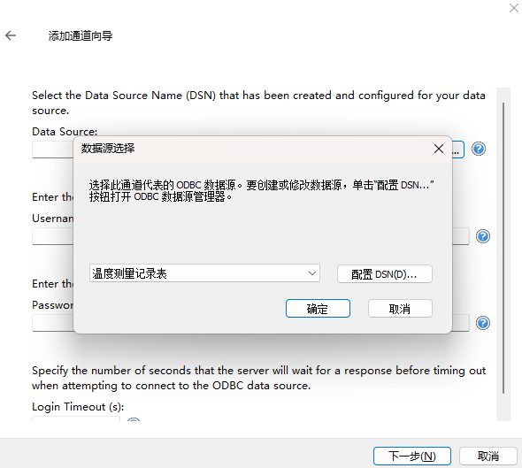
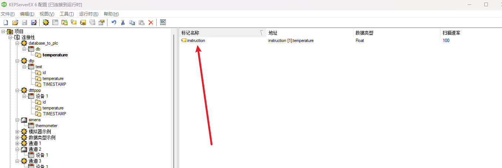
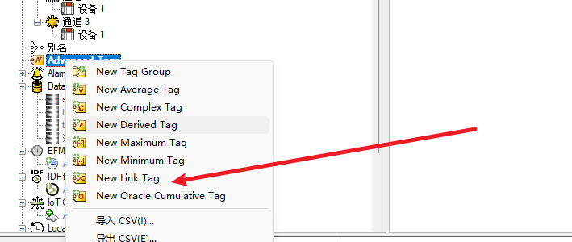

Contents
---
- [安装 kepserver](#安装-kepserver)
- [PLC interacts with Database](#plc-interacts-with-database)
    - [PLC to Database](#plc-to-database)
        - [kepserver 读 PLC](#kepserver-读-plc)
        - [kepserver 写数据库](#kepserver-写数据库)
    - [Database to PLC](#database-to-plc)
        - [kepserver 读数据库](#kepserver-读数据库)
        - [kepserver 写PLC](#kepserver-写plc)
- [Some bugs](#some-bugs)
---

# 安装 kepserver
> 资料和[手册](./使用手册)  
1. 点击[下载kepserver](./安装包/kepserver.zip)  
2. 安装后打开安装目录，将破解补丁复制替换即可,注意要先 kill kepserver 进程。
---
# PLC interacts with Database
> 以S7-200 smart 和 MySQL 为例。

## PLC to Database

### kepserver 读 PLC  
1. 打开 kepserver, 右键点击连接性，然后左键点击新建通道。
2. 然后选择通道类型为 Siemens TCP/IP Ethernet。命名后，选择和 PLC 同一个网段的网络适配器。然后一直下一步即可。
      
    
3. 然后单击添加设备,命名后选择相应的PLC型号，这里我选择的是 S7-200，然后下一步输入 PLC 的 IP，即上图的192.168.2.1。
4. 一直下一步到这个界面，将其中的 TSAP 改为200或者201或者300或者301(这些数字仅仅针对S7-200) 填入其中。然后下一步即可
    
5. 然后点击刚刚创建的设备，再点击添加静态标记。
    
6. 这里我们以读取温度为例，如下图所示，表示温度的浮点类型存储在 VD100.
    
    我们关注三个字段即可，即名称，地址和数据类型。将地址和数据类型填入和 PLC 中的一致即可。
    
7. 点击导航栏上的工具，启动 OPC Client 即可查看对应的静态标记是否读取成功。如下图所示，我们成功读取到了实际温度。
    

---
### kepserver 写数据库
---
1. 右键 Date Logger, 新建 log group  
2. 配置 DSN：
    1. 在Windows 菜单栏里搜索 ODBC，如下图所示，注意是32bit，以管理员身份运行。
        
    2. 点击系统 DSN，并添加驱动，如下图，如果未找到所需的驱动，请去相应的官网下载。MySQL的驱动[下载](https://dev.mysql.com/downloads/connector/odbc/), MSI Installer(32-bit)。
        
    3. 点击确认后，会弹出如下界面，填入数据源名称，数据库IP，数据库的用户名和相应的密码并测试连接后，指定一个已经存在的数据库名，若不指定将报错。
        
        在终端中查看本地IP，在Windows中键入ipconfig，在Linux中键入ifconfig即可查看本地IP地址。
        
    4. 配置成功后，再回到新建的 log group 中，选择刚刚配好的 DSN 即可。
        
3. General 界面配置如下参数即可。
    
4. 转到下一个界面，Data Map 界面，点击 browse, 添加需要监测的变量。
    
    1. Table selection 选项以第三项为例，即创建一个新的 data-sheet, 并取名为 test
    
    2. Table format 我们以第二项为例，即 wide 模式。然后点击 Map Fields .
    
    3. 可以看到表的字段名冗长，我们选中其中的温度字段，点击 Modify 修改字段名称为 temperature.
    
    4. Process Item Map 的第一列是我们真正写入数据库的变量，第二列是绑定的字段名。选择测量温度的变量，点击 link，可以和下面选中的字段进行绑定，点击 clear 即解除绑定。这里我们仅仅保留时间戳和温度值两项。
    

5. 然后转到触发器界面。这里我们直接修改默认的触发器，并更改记录的时间间隔。如下图。
    
6. 点击Data Logger 外的其他选项触发保存。保存完毕后 log group 会自动运行并在 kepserver 最底下输出日志。这里可以看到连接成功了。
    
8. 查看数据库的数据确认是否写入成功，可以直接通过终端登入 MySQL 或者通过其他软件查看，这里以 Navicat 软件为例。这里可以看到我们指定的字段写入成功了。
    

## Database to PLC  

### kepserver 读数据库
1. 右键连接性，新建通道，通道类型为 ODBC Client。
2. 下一步至这个界面，选择配置好的 DSN ，填入相应的用户名和密码。
    
3. 通道建立完成后点击添加设备，型号为MySQL。
    
4. 下一步至该界面，选择要读取的表。
    
5. 下一步至完成，可以看到成功读取到了数据库的内容。
    

### kepserver 写PLC
> 下面，将数据库里读到的值写入 PLC，这是一个传达指令的指令表。如下图所示：
    
1. 按照上述步骤将数据库的内容读取到 kepserver，即下图的 instruction 标记,标记 sp 读取的是 PLC 的 VD104, 通过 OPC 确认是否读取成功。
    
    
2. 点击 Advanced Tags, 然后右键点击 New Link Tag, 如下图所示：
    
3. 选择从数据库读入的变量，指定输入和输出变量，即 instruction 为输入，sp 为输出，即可完成从数据库到 PLC 的变量映射,如下图所示：
    
    
4. 创建完成后自动启动，我们测试一下，是否能从数据库将数据写入 PLC:
    更改前：
    
    更改后：
    
    至此，我们完成了从数据库到 PLC 的写操作。

### Some bugs
1. 起始记录的数据可能为零，即脏数据。
2. PLC 运行停机再运行的情况下，kepserver 中一些 tags 可能需要手动重启, 如 Advanced tags。

