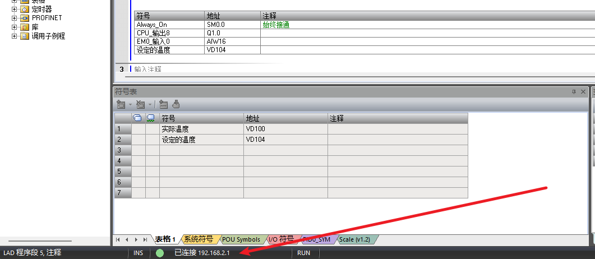
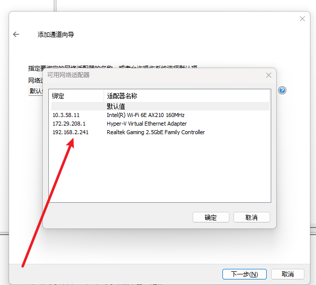

## 安装kepserver
> 资料和[手册](./使用手册/kepserverex-manual.pdf)  
1. 点击[下载](./安装包/kepserver.zip)  
2. 安装后打开安装目录，将破解补丁复制替换即可  

## PLC to Database
> 以S7-200 smart 和 MySQL 为例。
1. 打开kepserver, 右键点击连接性，然后左键点击新建通道。
2. 然后选择通道类型为 Siemens TCP/IP Ethernet。命名后，选择和PLC同一个网段的网络适配器。
      
    
3. 然后单击添加设备

### kepserver读PLC

#### 读取plc指定变量地址

#### kepserver写数据库

## Database to PLC

### kepserver读数据库

### kepserver写PLC

### Some bugs
