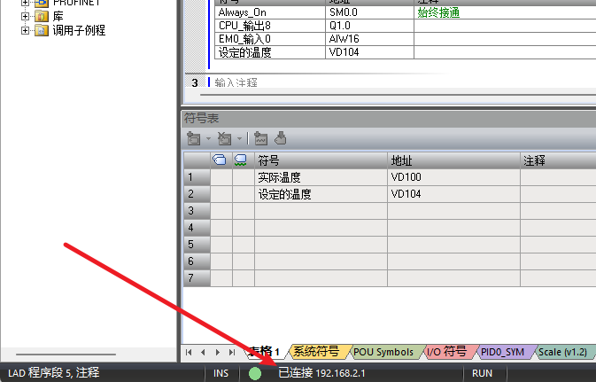
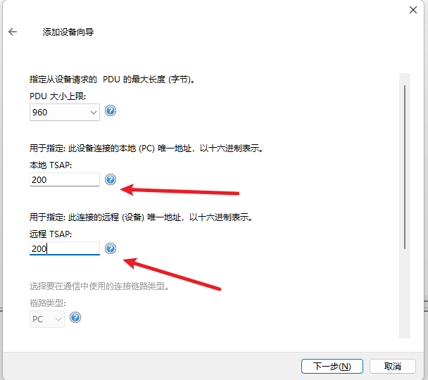
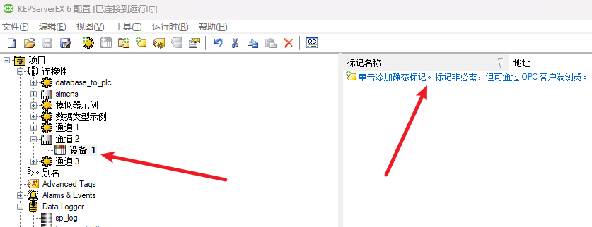
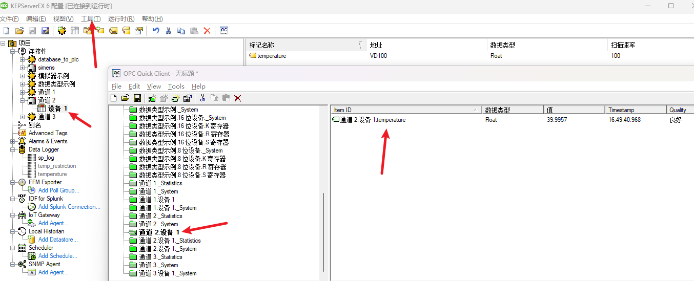
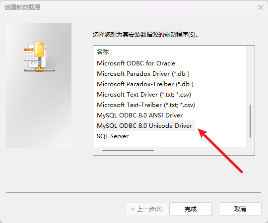
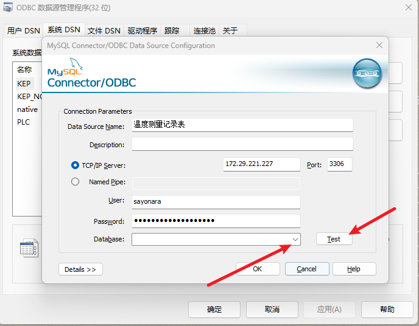

## 安装kepserver
> 资料和[手册](./使用手册)  
1. 点击[下载kepserver](./安装包/kepserver.zip)  
2. 安装后打开安装目录，将破解补丁复制替换即可,注意要先 kill kepserver 进程。

# PLC interacts with Database
> 以S7-200 smart 和 MySQL 为例。

## PLC to Database

### kepserver读PLC
1. 打开kepserver, 右键点击连接性，然后左键点击新建通道。
2. 然后选择通道类型为 Siemens TCP/IP Ethernet。命名后，选择和PLC同一个网段的网络适配器。然后一直下一步即可。
      
    
3. 然后单击添加设备,命名后选择相应的PLC型号，这里我选择的是S7-200，然后下一步输入PLC的IP，即上图的192.168.2.1。
4. 一直下一步到这个界面，将其中的TSAP改为 200或者201或者300或者301(这些数字仅仅针对S7-200) 填入其中。然后下一步即可
    
5. 然后点击刚刚创建的设备，再点击添加静态标记。
    
6. 这里我们以读取温度为例，如下图所示，表示温度的浮点类型存储在VD100.
    
    我们关注三个字段即可，即名称，地址和数据类型。将地址和数据类型填入和PLC中的一致即可。
    
7. 点击导航栏上的工具，启动OPC Client即可查看对应的静态标记是否读取成功。如下图所示，我们成功读取到了实际温度。
    

### kepserver写数据库
1. 右键 Date Logger, 新建 log group  
2. 配置DSN：
    1. 在Windows菜单栏里搜索ODBC，如下图所示，注意是32bit，以管理员身份运行。
        
    2. 点击系统DSN，并添加驱动，如下图，如果未找到所需的驱动，请去相应的官网下载。MySQL的驱动[下载](https://dev.mysql.com/downloads/connector/odbc/),MSI Installer(32-bit)。
        
    3. 点击确认后，会弹出如下界面，填入数据源名称，数据库IP，数据库的用户名和相应的密码并测试连接后，指定一个已经存在的数据库名。在终端中查看本地IP，在Windows中键入ipconfig，在Linux中键入ifconfig即可查看本地IP地址。
        
        

## Database to PLC

### kepserver读数据库

### kepserver写PLC

### Some bugs
