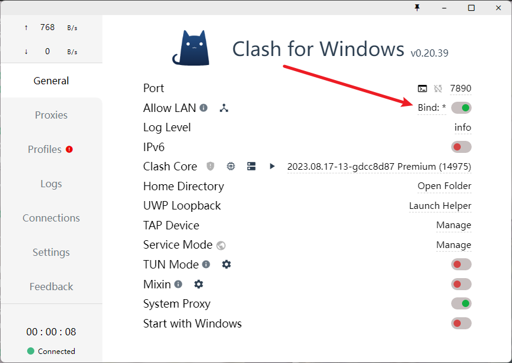
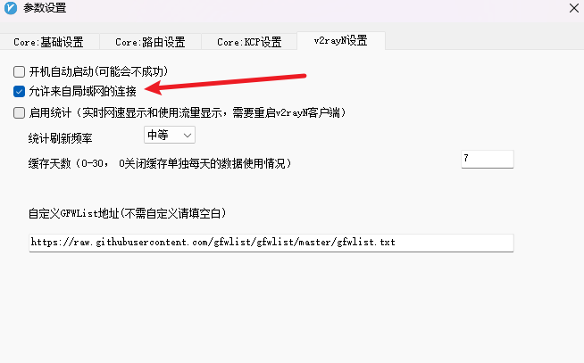

### WSL INSTALL
1. search string "功能" in windows menu.
2. click the setting -- "启动或关闭Windows功能"
3. selet subsystem for linux and virtual machine platform.
4. restart your computer
5. open Microsoft store and search string "wsl" and install what you want.
6. click open after finishing installation. Then a terminal will be shown.
7. if encounter error, open powershell in a new terminal and run `wsl --update`


#### some examples
> `wsl -l -v`  
> `wsl --help`  
> `wsl --export <Distri> <Path-to-store>`  
> `wsl --import <New-Name> <Installation-DIR> <Path-exported-Package>`  
> `wsl --unregister <Distri>`  
> `wsl -d <Distri> -u <User-Name>`  


### 在代理软件中打开允许局域网连接选项
<p></p>

### 连接局域网代理
```shell
# For clash the port is 7890
export http_proxy="http://[YOUR_WINDOWS_IP]:10809"
export https_proxy=$http_proxy
```


