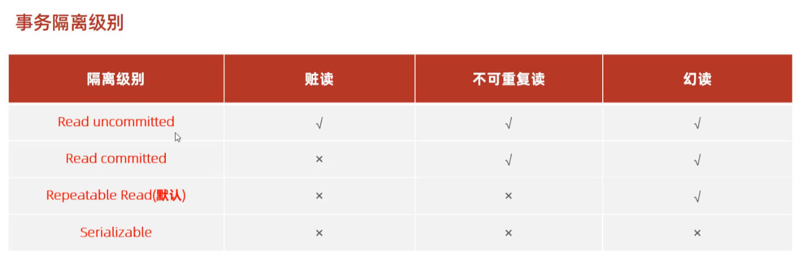

### Install mysql on Ubuntu
```shell
#Enter below in terminal orderly.
sudo apt update;
sudo apt install mysql-server;
sudo mysql_secure_installation;
```

### Configuration for access remotely
1. `cd /etc/mysql/mysql.conf.d`
2. `sudo vim mysqld.cnf`
3. `bind-address = 0.0.0.0`
4. `<ESC>:wq` to exit vim editor
5. `systemctl restart mysql.service`

### DDL-database
```mysql
SHOW DATABASES;
SELECT DATABASE();
CREATE DATABASE IF NOT EXISTS [NAME];
DROP DATABASE [NAME];
USE [NAME];
```

### DDL-sheet
```
SHOW TABLES;
//创建表
CREATE TABLE [NAME](
    key type comment 'content',
    ....
    )comment 'content';
//查看创建表时的语法
SHOW CREATE TABLE [NAME];
//修改表名
ALTER TABLE [NAME] RENAME TO [NEW-NAME];
//删除表
DROP TABLE [NAME];
//截断表
TRUNCATE TABLE [NAME];
//查看表结构
DESC [TABLE-NAME];

//添加字段类型
ALTER TABLE [NAME] ADD [FIELD-NAME] TYPE COMMENT 'CON';
//修改字段类型
ALTER TABLE [NAME] MODIFY [FIELD-NAME] TYPE;
//修改字段名和字段类型
ALTER TABLE [NAME] CHANGE [OLD-NAME] [NEW-NAME] TYPE;
//删除字段
ALTER TABLE [NAME] DROP [FIELD-NAME];

```

### sheet-data-type
> Number type  

|Type|Size(byte)|
|:---|:---:|
|TINYINT|1|
|SMALLINT|2|
|MEDIUMINT|3|
|INT|4|
|BIGINT|8|
|FLOAT|4|
|DOUBLE|8|

------
> Text type  

|Type|Size(byte)|Description|
|:--|:--|:--|
|CHAR|0-255|Constant length|
|VARCHAR|0-65535|Mutable length|
|TINYBLOB|0-255|


### DML
```
//添加数据
INSERT INTO [NAME] (FILED_1,..) VALUES(VAL_1,..);
INSERT INTO [NAME] VALUES(VAL_1,..);
//修改数据,如果不带where，则更新整张表的字段值
UPDATE [NAME] SET [FIELD-NAME]=[VAL],.. WHERE [CONDITION];
//删除数据--删除记录,即一行,如果不带where则删除所有记录
DELETE FROM [NAME] WHERE [CONDITION];
```

### DQL
```
SELECT 字段1,字段2... FROM [NAME];
SELECT DISTINCT [FIELD-NAME] FROM [NAME];
SELECT [FIELD-NAME] FROM [NAME] WHERE [CONDITION];
//聚合函数,纵向计算：count max min avg sum
SELECT COUNT(*) FROM NAME;
//分组
SELECT [FIELD-NAME] FROM [NAME] GROUP BY [FIELD-NAME];
//排序
SELECT [FIELD-NAME] FROM [NAME] ORDER BY [FIELD-NAME-1] ASC,[FIELD-NAME-2] DESC;
//分页
SELECT [FIELD-NAME] FROM [NAME] LIMIT [INDEX],[RECORDS-NUMBER];
```
----

----


### DCL
```
use mysql;
select * from user;
create user 'user-name'@'host-name' identified by 'password' [with grant option];

//grant system_user on *.* to 'root';
//the below instruction may raise error
alter user 'user-name'@'host-name' identified with mysql_native_password by 'new-password';

drop user'user-name'@'host-name';

//examples
create user 'sayonara'@'%' identified by '121234';
update user set host='%' where user = 'root';

show grants for 'user-name'@'host-name';
//database-name and sheet-name could be matched with *
grant [privilege] on database.sheet_name to 'user-name'@'host-name';
revoke [privilege] on database.sheet_name to 'user-name'@'host-name';
flush privileges;
```


### Functions
```
/*number function*/
ceil();
floor();
mod(x,y);   //返回x/y的模
rand();     //0~1之间的随机数
round(x,y); //四舍五入，有效位数y

/*string function*/
concat(s1,s2..s3);
trim(str);  //erase the space of two end;
substring(str,start,len);

/*date function*/
curdate();
curtime();
now();
year(date);
month(date);
day(date);
datediff(date1,date2); //return date2 - date1 Days;
//example
select name,datediff(curdate(),entrydate) as entrydays from emp order by entrydays;

/*branch function*/
if(value,t,f);      //equal to ()?:
ifnull(val1,val2)   //if val1 is not null, then return val1;
//if val1 is true, then return res1;
case when [val1] then [res1] ... else [default] end;
//if expr is equal to val1,then...
case [expr] when [val1] then [res1] ... else [default] end;
```

### 约束
> To keep the data clean.
```
not null;
unique;
primary key;
auto_increment;
default;
check;
foreign key;
```

### 多表查询

### 事务
```
select @@autocommit;
set @@autocommit = 0;

start transaction;  //即手动，需commit;
commit;
rollback;

select @@transaction_isolation; //查看隔离级别
set [session|global] transaction isolation level [LEVEL];
```



-------
### 索引
> A datastructure designed for querying.
```
show index from [table-name];
create index [index-name] on [table-name]([field-name]);
create unique index [index-name] on [table-name]([field-name]);
drop index [index-name] on [table-name];
```

### 性能分析
> Check the duration of each instruction.
```
select @@have_profiling;
set profiling = 1;
show profiles;
```

### 存储过程
##### 基本语法
```
create procedure proc-name([IN|OUT|INOUT] para Type,...)
begin
  sql script;
end;
show create procedure proc-name;

call proc-name();
//查看存储过程
select * from information_schema.ROUTINES where ROUTINE_SCHEMA = 'database.name';
drop procedure if exists proc-name;
//set end sign;
delimiter $$
```

##### 变量
```
//系统变量
show [session|global] variables;
show [session|global] variables like '___';
select @@[session|global].variable_name;
set [session|global] val-name = value;

//用户变量,无需提前声明
set @var-name=value;
select [field-name] into @var-name from [table-name];
select @var-name;

//局部变量,需提前声明
declare var-name type [default val];
set var-name = value;
//example
create procedure p1()
begin
    declare stu int default 0;
    select count(*) into stu from stu;
    select stu;
end;
```

##### 流程语句
```
if [test] then
    ...;
elseif [test] then
    ...;
else
    ...;
end if;

while [test] do
    ...;
end while;
```

##### 存储函数
```
//输入参数只能是in
create function name(name type)
returns type [determinstic|no sql|reads sql data]
begin
    ...;
    return variable;
end;
```

### 锁
```
//global lock : lock database, read only;
flush tables with read lock;
unlock tables;
//sheet lock : lock sheet: read lock & write lock
//read : only read for everyone
//write: others can do nothing
lock tables [sheet-name] [read|write];
unlock tables;


```

### 配置文件
```
mysql --help | grep my.cnf
```


